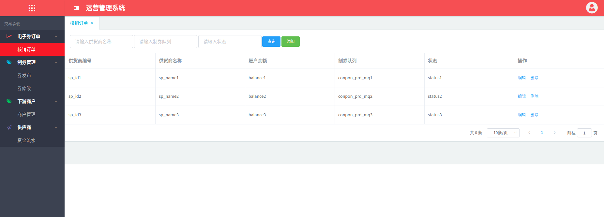
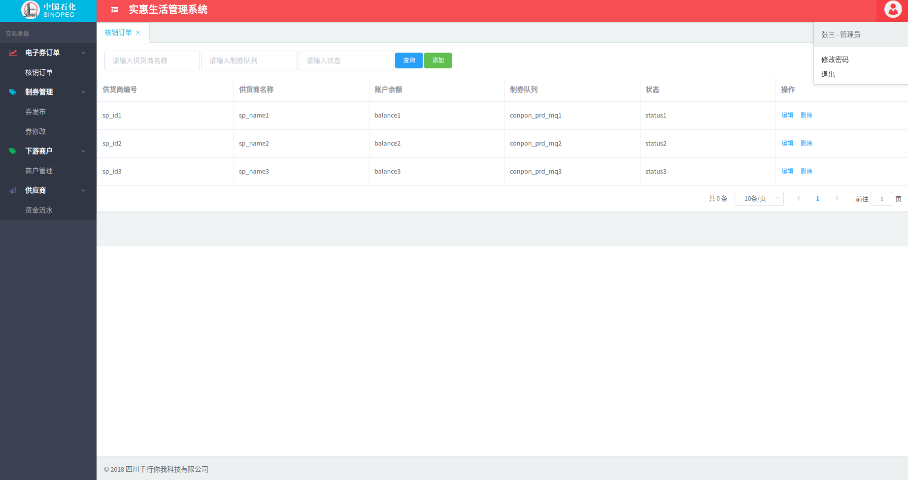

# nav-menu

> vue 后台管理系统菜单组件 nav-menu

`引用menu组件实现后台管理系统的菜单相关功能`

√　配置菜单数据，展示相关菜单;      
√　用户信息，不配置时不显示;  
√　配置系统名称，不配置时为默认"运营管理系统"；  
√　系统logo，配置logo时显示上传的logo，不配置时为默认的logo；   
√　系统版权，不配置时不显示；   
√　系统主题，不配置主题时为显示默认的主题；  

### 安装使用
``` bash
npm install nav-menu --save
```

### 使用方法

#### 简单使用
``` js
<template>
  <div>
    <nav-menu
      :menus="menus"
      ref="menu"
    >
    </nav-menu>
  </div>
</template>
```

```　js
<script>
  import navMenu from 'nav-menu'; // 引入
  export default {
    data () {
      return {
        menus:[{}],  //菜单数据
      }
    },
    components:{ //注册插件
      navMenu
    },
    mounted(){     
      this.getMenu()
      //向组件添加一个自定义标签，点击标签会路由到一个页面
      this.$refs.menu.open("核销订单", "/user/bind");   //设置默认页面
    },
    methods:{
      getMenu(){
        // 这里获取菜单数据
        this.$post("/sso/menu/get")
          .then(res => {
            this.menus = res;
          })
          .catch(err => {
            console.log(err)
          });
      },
    }
  }
</script>
```

#### 图片预览




#### 配置参数说明

|参数名 | 参数值 |   是否必传 | 说明　|　实例|  
|:---:|-|-|-|-|-|  
|menus | [{}]  | 是 | 菜单数据　|　详见如下（menus详解）|  
userinfo | {}  | 否　|　用户信息（不传时不显示）|　{ name: "张三", role: "管理员" }  
systemName | String  | 否　| 系统名称（默认为＂运营管理系统＂）|　"实惠生活管理系统"  
logo | String  | 否　|　logo地址（不传为默认logo）|　"http://sso.sinopecscsy.com/static/img/43612a9fe1f92658cc3bc6e3edc0766e.png"
copyright | String  | 否　| 版权(不传时不显示)| "四川千行你我科技有限公司"  
themes | String  | 否　|　主题　|   

#### menus详解

menus是菜单数据 其格式为

``` js
[{
  "children": [{
    "children": [{
      "create_time": "2018-09-13 15:17:05",
      "icon": " ",
      "id": "10568",
      "is_open": "0",
      "level_id": "3",
      "name": "核销订单",
      "parent": "10564",
      "path": "/user/bind",
      "sortrank": "10568",
      "sys_id": "221"
    }],
    "create_time": "2018-09-13 15:14:19",
    "icon": "fa fa-line-chart text-danger",
    "id": "10564",
    "is_open": "1",
    "level_id": "2",
    "name": "电子券订单",
    "parent": "10563",
    "path": "-",
    "sortrank": "1",
    "sys_id": "221"
  }],
  "create_time": "2018-09-13 15:13:39",
  "icon": " ",
  "id": "10563",
  "is_open": "0",
  "level_id": "1",
  "name": "交易承载",
  "parent": "0",
  "path": "-",
  "sortrank": "1",
  "sys_id": "221"
}]
```
其中path:-> 数据为相应菜单的路由地址
name:->相应路由的名称


``` js
<template>
  <div>
    <nav-menu
      :menus="menus"
      ref="menu"
      :userinfo="userinfo"
      :systemName="systemName"
      :copyright="copyright"
      :themes="themes"
      :logo="logo"
    >
    </nav-menu>
  </div>
</template>
```

``` js
<script>
  import navMenu from 'nav-menu'; // 引入
  export default {
    data () {
      return {
        menus:[{}],  //菜单数据
        systemName:"实惠生活管理系统",  //系统名称
        logo:"http://sso.sinopecscsy.com/static/img/43612a9fe1f92658cc3bc6e3edc0766e.png",
        copyright:"2018 四川千行你我科技有限公司", //版权信息
        themes:"bg-info|bg-danger|bg-dark", //顶部左侧背景颜色,顶部右侧背景颜色,右边菜单背景颜色
        userinfo:{ name: "张三", role: "管理员" }
      }
    },
    components:{ //注册插件
      navMenu
    },
    mounted(){     
      this.getMenu()
      //向组件添加一个自定义标签，点击标签会路由到一个页面
      this.$refs.menu.open("核销订单", "/user/bind");   //设置默认页面
    },
    methods:{
      getMenu(){
        // 这里获取菜单数据
        this.$post("/sso/menu/get")
          .then(res => {
            this.menus = res;
          })
          .catch(err => {
            console.log(err)
          });
      },
    }
  }
</script>
```

#### 图片预览


### 设置默认页面

>　直接调用open方法传菜单和相应的路由

``` js
this.$refs.menu.open("核销订单", "/user/bind");  //设置默认页面
```
