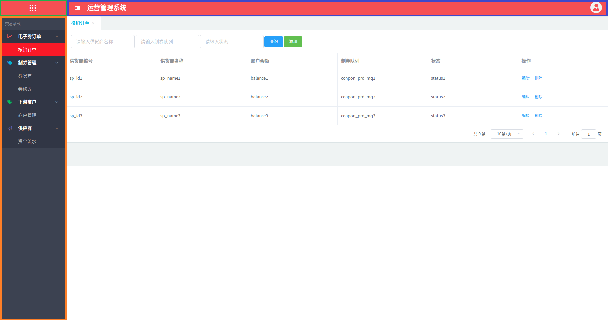
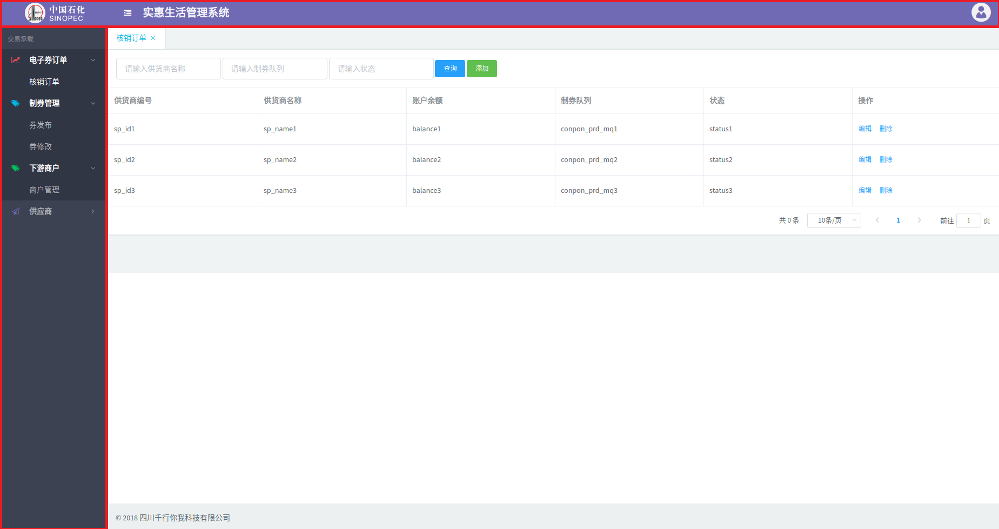
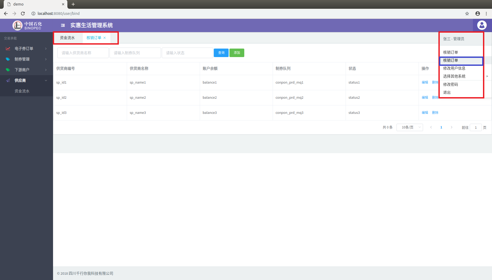

# nav-menu

vue 后台管理系统菜单组件

引用`menu`组件实现后台管理系统的菜单相关功能，该组件可以实现菜单展示，主题自定义，系统logo自定义上传，用户信息展示，版权信息展示等相关功能，使用简单，配置方便

√　根据相关数据格式配置菜单数据，就可以展示相关菜单效果;      
√　用户可以把当前登录用户信息配置，展示出用户的信息，没有配置时不显示用户信息;  
√　配置好系统名称，展示在顶部，不配置时展示为默认"运营管理系统"；  
√　系统logo，有配置logo时显示上传配置的logo图标，没有配置时则为默认的logo；   
√　系统版权，配置了系统版权信息，则显示相关内容，没有配置时不显示版权信息；   
√　系统主题，可以根据配置显示不同的主题，没有配置主题时则显示默认的主题；  

## 一、使用实例

使用组件时使用`npm install`引用

``` bash
npm install nav-menu --save
```

引用指定版本

``` bash
npm install nav-menu@版本号
```

在vue中的`template`标签中加入引用的组件`nav-menu`及必须配置好相关格式的菜单数据

``` js
<template>
  <div>
    <nav-menu
      :menus="menus"
      ref="menu"
    >
    </nav-menu>
  </div>
</template>
```

```　js
<script>
  import navMenu from 'nav-menu'; // 引入
  export default {
    data () {
      return {
        menus:[{}],  //菜单数据
      }
    },
    components:{ //注册插件
      navMenu
    },
    mounted(){     
      this.getMenu()
    },
    methods:{
      getMenu(){
        // 这里获取菜单数据
        this.$post("/sso/menu/get")
          .then(res => {
            this.menus = res;
            this.$refs.menu.open("核销订单", "/user/bind");   //设置默认页面
          })
          .catch(err => {
            console.log(err)
          });
      },
    }
  }
</script>
```

> `open("核销订单", "/user/bind")` 设置默认页面，在菜单加载完时，通过该方法打开一个默认的菜单页面.使用方法如下：

``` js
this.$refs.menu.open("核销订单", "/user/bind");   //设置默认页面
```

## 二、效果预览

组件简单使用时，引用组件，配置好菜单的相关数据就可使用，其效果图如下：



1. 绿色区域为系统logo，没有配置logo参数时显示;  
2. 蓝色区域包括系统名称与用户信息，没有配置系统名称时默认为"运营管理系统";  
3. 橙色区域是菜单，通过必须参数把菜单数据配置好所呈现的效果;  

## 三.参数配置实例

### 参数说明

| 参数名 | 参数值 |   是否必传   | 说明　|　实例 |  
| :---: | :---: | :---: | :---: | :---: |    
| menus | [{}]  | 是 | 菜单数据　|　详见如下（menus详解）|  
| items | [] | 否　|　用户菜单数据（不传时不显示）|　详见如下（items详解）|  
| userinfo | {} | 否　|　用户信息（不传时不显示）|　{ name: "张三", role: "管理员" }|  
| systemName | String | 否　| 系统名称（默认为"运营管理系统"）|　"实惠生活管理系统"|  
| logo | String  | 否 |　logo地址（不传为默认logo）|　"http://sso.sinopecscsy.com/static/img/test.png" | 
| copyright | String  | 否　| 版权(不传时不显示)| "四川千行你我科技有限公司"|  
| themes | String  | 否　|　主题　| 详见（主题详解）|  

#### menus详解

menus是菜单数据 其格式为

``` js
[{
  "children": [{
    "children": [{
      "is_open": "0",
      "level_id": "3",
      "name": "核销订单",
      "path": "/user/bind"
    }],
    "icon": "fa fa-line-chart text-danger",
    "is_open": "1",
    "level_id": "2",
    "name": "电子券订单"
  }],
  "is_open": "0",
  "level_id": "1",
  "name": "交易承载"
}]
```

1. is_open:-> 表示菜单是否展开显示 0:关闭 1:展开 只有`level_id="2"` 菜单分类层时才有效果  
2. level_id:-> 表示结构层级关系 有三层结构第一层为总菜单，每二层为菜单分类 第三层为菜单层   
3. path:-> 表示为相应菜单的路由地址 只有`level_id="3"`时才会有菜单相应的地址  
4. name:-> 相应菜单的名称  

使用时只需要按照相关的格式构造数据并传入到组件中就可使用  

#### items详解

items是在用户信息中显示可配置的菜单数据 其格式为

``` js
items: [
  {
    name: "核销订单",
    path: "/user/bind",
    type: "blank"
  },
  {
    name: "核销订单",
    path: "/user/bind",
    type: "self"
  },
  {
    name: "修改用户信息",
    type: "dialog"
  },
  {
    name: "选择其他系统",
    items: [
      {
        name: "短信系统",
        path: "/msg",
      },
      {
        name: "大象车生活",
        type: "self",
        path: "/user/bind",
      },
      {
        name: "---"
      },
      {
        name: "分销系统",
        type: "self",
        path: "http://www.baidu.com",
      },
      {
        name: "卡券系统",
        path: "/carlife",
      }
    ]
  }
]
```

1. name:-> 为菜单的名称  在第二层的items数组时,当`name: "---"`表示一个分隔线
2. path:-> 为相应菜单名称的路径，可缺省
3. type:-> 为菜单的类型默认值为"blank" 其类型分为: `blank`表示在浏览器中另开一个标签页打开 `self`表示在本标签打开 `dialog`表示可定义事件回调操作在使用时实现dialog方法便可实现相应的需求

根据配置不同的类型及数据实现不同的需求

#### 主题详解

主题的样式格式为 菜单区域、顶部区域、内容区域，三个样式以 "|"分隔，如下所示：

``` js
bg-info|bg-danger|bg-dark //默认主题
```

还可以选择设置不同的主题样式如图所示：

 

1. bg-black|bg-white|bg-black
2. bg-dark|bg-white|bg-dark
3. bg-white|bg-white|bg-black
4. bg-primary|bg-white|bg-dark
5. bg-info|bg-white|bg-black
6. bg-success|bg-white|bg-dark
7. bg-danger|bg-white|bg-dark
8. bg-danger|bg-white|bg-light
9. bg-black|bg-black|bg-white
10. bg-dark|bg-dark|bg-light
11. bg-info|bg-info|bg-light
12. bg-primary|bg-primary|bg-dark
13. bg-info|bg-info|bg-black
14. bg-success|bg-success|bg-dark
15. bg-danger|bg-danger|bg-dark
16. bg-danger|bg-danger|bg-light

### 完整实例

在vue中的`template`标签中加入引用的组件`nav-menu`及实现必须的菜单数据及自定义各个元素数据及可实现相应效果

``` js
<template>
  <div>
    <nav-menu
      :menus="menus"
      ref="menu"
      :userinfo="userinfo"
      :systemName="systemName"
      :copyright="copyright"
      :themes="themes"
      :logo="logo"
      :items="items"
      :dialog="showDialog" //点击事件回调
    >
    </nav-menu>
  </div>
</template>
```

``` js
<script>
  import navMenu from 'nav-menu'; // 引入
  export default {
    data () {
      return {
        menus:[{}],  //菜单数据
        systemName:"实惠生活管理系统",  //系统名称
        logo:"http://sso.sinopecscsy.com/static/img/test.png",
        copyright:"2018 四川千行你我科技有限公司", //版权信息
        themes:"bg-info|bg-danger|bg-dark", //顶部左侧背景颜色,顶部右侧背景颜色,右边菜单背景颜色
        userinfo:{ name: "张三", role: "管理员" },
        items: [
          {
            name: "核销订单",
            path: "/user/bind",
            type: "blank"
          },
          {
            name: "核销订单",
            path: "/user/bind",
            type: "self"
          },
          {
            name: "修改用户信息",
            type: "dialog"
          },
          {
            name: "选择其他系统",
            items: [
              {
                name: "短信系统",
                path: "/msg",
              },
              {
                name: "大象车生活",
                type: "self",
                path: "/user/bind",
              },
              {
                name: "---"
              },
              {
                name: "分销系统",
                type: "self",
                path: "http://www.baidu.com",
              },
              {
                name: "卡券系统",
                path: "/carlife",
              }
            ]
          }
        ],
      }
    },
    components:{ //注册插件
      navMenu
    },
    mounted(){     
      this.getMenu()
    },
    methods:{
      getMenu(){
        // 这里获取菜单数据
        this.$post("/sso/menu/get")
          .then(res => {
            this.menus = res;
            this.$refs.menu.open("核销订单", "/user/bind");   //设置默认页面
          })
          .catch(err => {
            console.log(err)
          });
      },
      showDialog(){
        //处理回调
      }
    }
  }
</script>
```

## 四、不同配置效果预览

组件通过参数配置使用时，引用组件，配置菜单数据及相关配置参数，其效果图如下：

|   图1-1 |  图1-2   |
| :-----: | :-----: |
|   |  |
|   图1-3 |  图1-4   |
|   |  |
|   图1-5 |  图1-6   |
|   |  |

图1-1 红色区域为配置的系统logo，绿色区域为配置的系统名称，蓝色区域为配置的用户信息，橙色区域为配置的菜单，紫色区域为配置的版权  
图1-2 配置了不同的主题所展示的效果
图1-3 配置额外菜单数据的显示效果
图1-4 当配置数据`type: "blank"`时会另起一个标签页打开相应的地址
图1-5图1-6 当配置数据`type: "self"`时在本标签打开相应的地址

> 项目中自带`demo`可自行下载运行查看
